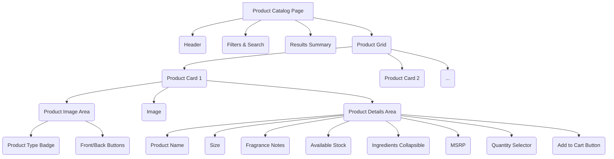

# Product Catalog and Product Card Implementation Plan

**Objective:** Implement the product catalog and product card views to precisely replicate the layout and styling shown in the provided image. Ensure the database schema supports the required data structure and stock availability is fetched correctly.

**Current Status:**
*   Database schema (`supabase/schema.sql` and `scripts/update_products_table.sql`) includes necessary fields (`name`, `size`, `scent`, `ingredients`, `inventory.quantity_in_stock`).
*   `src/components/ProductCatalog.tsx` has a basic structure for fetching and displaying this data.
*   The inventory data in `public/product-images/InventoryJSON.txt` aligns with the schema.

**Plan Steps:**

1.  **Review and Refine UI Layout:** Analyze the `src/components/ProductCatalog.tsx` file and compare its current structure and styling (using Tailwind CSS classes) against the provided image. Adjust padding, margins, spacing, and the arrangement of elements within the product cards (`<CardContent>`) to match the visual design precisely.
2.  **Adjust Styling Details:** Fine-tune the styling of text elements, buttons, badges, and the quantity selector to replicate the fonts, colors, sizes, borders, and shadows seen in the image. Ensure the MSRP is displayed with a strikethrough as shown.
3.  **Confirm Data Display:** Double-check that all required data points (Product Name, Size, Fragrance Notes, Ingredients, Available Stock, MSRP) are correctly fetched and displayed in their designated locations on the product card, matching the image layout.
4.  **Verify Image Handling and Buttons:** Ensure the product image display and the "Front"/"Back" buttons function correctly and are styled according to the image.
5.  **Responsive Design Check:** Review the existing responsive classes to ensure the grid layout adapts appropriately for different screen sizes, maintaining the visual integrity of the product cards.

**Conceptual Structure:**

**Next Steps:**

Once this plan is approved, switch to Code mode to implement the changes in `src/components/ProductCatalog.tsx`.