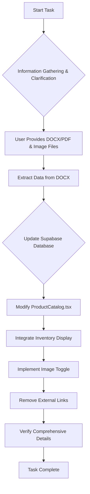

# Product Catalog Update Plan

**Objective:** Update the product catalog by integrating product details and inventory data from the provided `Inventory Table.docx` and product image files into the `ProductCatalog.tsx` component and the Supabase `products` table. Remove all external links to official sites.

**Information Gathering Summary:**
*   **Primary Data Source:** `Inventory Table.docx` will be the primary source of truth for all product data, including inventory, name, description, price, size/weight, SKU, and ingredients.
*   **Inventory Display:** Both the status (e.g., 'In Stock', 'Low Stock', 'Out of Stock') and the exact quantity will be displayed on each product card.
*   **Image Display:** The front image will be displayed by default, with a toggle to show the back image.
*   **Image Naming Convention:** Front images are named `item_number.jpg`, and back images are named `item_number-B.jpg`.

**Detailed Plan:**

## Phase 1: Data Extraction and Preparation

1.  **Extract Data from DOCX:**
    *   Read the content of `public/product-images/Inventory Table.docx`.
    *   Parse the DOCX content to extract product information: `LOCATION`, `QUANTITY`, `PRODUCT NAME`, `SIZE`, `PRODUCT TYPE`, `ITEM NUMBER`, `MSRP`, `FRAGRANCE`, and `INGREDIENTS`.
    *   Handle potential formatting inconsistencies (e.g., line breaks within fields, extra spaces).
    *   Map extracted data to a structured format suitable for the `DatabaseProduct` interface and for adding inventory.

## Phase 2: Supabase Database Update

1.  **Update `products` table schema (if necessary):**
    *   Review the existing `DatabaseProduct` interface in `src/components/ProductCatalog.tsx` and compare it with the data extracted from the DOCX.
    *   Add `quantity: number;` and `location: string;` fields to the Supabase `products` table.
    *   Remove `brand_website_link` column from the Supabase `products` table.

2.  **Populate/Update Supabase `products` table:**
    *   For each product extracted from the DOCX:
        *   Check if a product with the `item_number` already exists in the Supabase `products` table.
        *   If it exists, update its details (name, product_type, size, msrp, scent, ingredients, description, image_url, is_active, quantity, and location).
        *   If it does not exist, insert a new record with all relevant details.
        *   Ensure `image_url` is correctly set based on the `item_number` and the specified naming convention (e.g., `public/product-images/{item_number}.jpg`).
        *   Set `is_active` to `true` for all products from the DOCX.
        *   Ensure `brand_website_link` is removed or set to null for all entries.

## Phase 3: Frontend (`ProductCatalog.tsx`) Modifications

1.  **Update `DatabaseProduct` Interface:**
    *   Modify the `DatabaseProduct` interface to include `quantity: number;` and `location: string;`.
    *   Remove `brand_website_link: string;`.

2.  **Fetch Updated Product Data:**
    *   Ensure `fetchProducts` function correctly fetches the new `quantity` and `location` fields from Supabase.

3.  **Integrate Inventory Display:**
    *   In the product card rendering logic, add a section to display both the inventory status and the exact quantity.
    *   Define logic for inventory status (e.g., `quantity > 100` = 'In Stock', `1 < quantity <= 100` = 'Low Stock', `quantity === 0` = 'Out of Stock').
    *   Visually represent the status (e.g., using `Badge` component with different colors).

4.  **Implement Image Toggle:**
    *   Modify the image display section within the product card.
    *   Add state to manage which image (front or back) is currently displayed for each product.
    *   Create a toggle mechanism (e.g., a button or an icon) that switches between the front image (`public/product-images/{item_number}.jpg`) and the back image (`public/product-images/{item_number}-B.jpg`).
    *   Ensure the `image_url` in the `DatabaseProduct` interface can accommodate both front and back image paths, or handle this logic directly in the component.

5.  **Remove External Links:**
    *   Locate and remove the `View Details & Photos` button and any other code related to `product.brand_website_link` in `ProductCatalog.tsx`.

6.  **Comprehensive Product Details:**
    *   Verify that `product name`, `description`, `price (msrp)`, `size/weight`, `SKU (item_number)`, and `ingredients` are all correctly displayed and formatted on the product card, leveraging the updated `DatabaseProduct` interface and fetched data.

## Mermaid Diagrams

### High-Level Flow



### Data Flow for Product Catalog

```mermaid
graph LR
    A[Inventory Table.docx] --> B{Data Extraction & Parsing};
    B --> C[Structured Product Data];
    C --> D[Supabase products table];
    D -- Fetches Data --> E[ProductCatalog.tsx Component];
    F[public/product-images/] --> E;
    E --> G[Rendered Product Cards];
    G --> H[User Interaction (Image Toggle, Add to Cart)];