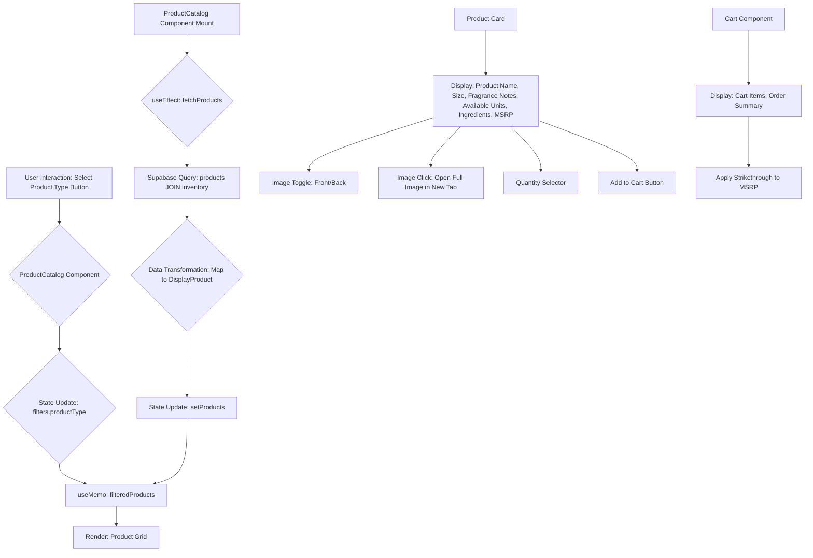

# Product Catalog and Cart Update Plan

This plan outlines the steps to enhance the product catalog display and filtering, and ensure consistent MSRP formatting across the application, while also replicating the product card design from the provided image.

## Phase 1: Database Schema and Data Fetching Updates

1.  **Update `supabase/schema.sql`**:
    *   Add `product_type` (VARCHAR), `size` (VARCHAR), `scent` (TEXT), and `ingredients` (TEXT[]) columns to the `products` table.
    *   Ensure `quantity_in_stock` is correctly linked and fetched from the `inventory` table.
    *   *Note:* The `msrp` column is already in `products` table in `schema.sql`. I will ensure `product_type`, `size`, `scent`, and `ingredients` are added.
    *   *Note:* The `InventoryJSON.txt` shows `INGREDIENTS` as a single string. I will need to store it as `TEXT` in the database and parse it into an array in the frontend, or update the seeding script to store it as `TEXT[]` if possible. Given the current `types.ts` has `string[] | null` for ingredients, I will assume the database should store it as an array. If the seeding script doesn't support `TEXT[]` directly, I'll need to handle the parsing in the frontend.

2.  **Update `src/integrations/supabase/types.ts`**:
    *   Verify that the `products` table `Row`, `Insert`, and `Update` types correctly reflect the new columns (`product_type`, `size`, `scent`, `ingredients`, `msrp`). (Based on previous analysis, these seem to be already present, but will be double-checked during implementation).

3.  **Modify `src/components/ProductCatalog.tsx` data fetching**:
    *   Update the `fetchProducts` function to directly select `product_type`, `size`, `scent`, `ingredients`, and `msrp` from the `products` table, instead of extracting them from `name` and `description`.
    *   Adjust the `FetchedProduct` and `DisplayProduct` interfaces to reflect these direct database fields.
    *   Ensure `quantity_in_stock` is still correctly fetched from the `inventory` table.

## Phase 2: Product Catalog UI Enhancements

1.  **Replace Filter Section with Product Type Buttons in `src/components/ProductCatalog.tsx`**:
    *   Remove the existing `Select` component for "Product Type" and the "Scent" input field.
    *   Implement a set of buttons (e.g., using `Button` or `ToggleGroup` from `@/components/ui`) for each unique `product_type` obtained from the fetched data (from `InventoryJSON.txt`).
    *   Add an "All" button to show all products.
    *   Update the `filters` state and `filteredProducts` logic to use the selected `product_type` from these buttons.
    *   Keep the "Search" input field.

2.  **Replicate Product Card Details and Design in `src/components/ProductCatalog.tsx`**:
    *   **Overall Card Layout**: Adjust the `CardContent` and `CardHeader` structure to match the layout seen in the provided screenshot, including the positioning of product name, image, and details.
    *   **Product Type Badge**: Add a `Badge` at the top right of the product image to display the `product_type` (e.g., "BODY CREAM", "BODY WASH").
    *   **Size**: Display the `size` field from the fetched product data on the product card, similar to "8 FL OZ / 237 ML" in the image.
    *   **Fragrance Notes**: Display the `scent` field (renamed from `fragranceNotes` in `DisplayProduct` to match `scent` in `types.ts`) from the fetched product data, prefixed with "Fragrance Notes:".
    *   **Number of Available Units**: Display the `quantity` (from `quantity_in_stock`) on the product card, prefixed with "Available:".
    *   **Ingredients**: Ensure the `ingredients` are correctly displayed using the existing `Collapsible` component, matching the visual style in the image. If `ingredients` are fetched as a string, I'll need to split them into an array for display. If they are fetched as `string[]`, no splitting is needed.
    *   **MSRP Strikethrough**: Apply strikethrough styling to the MSRP display on the product card (e.g., `<span className="line-through">${product.msrp.toFixed(2)}</span>`).

3.  **Maintain Existing Functionality in `src/components/ProductCatalog.tsx`**:
    *   Ensure the switching between front and back views of the product image remains functional.
    *   Ensure viewing the full image (opening in a new tab) remains functional.
    *   Ensure the quantity selector and "Add to Cart" button functionality remain intact.

## Phase 3: Cart UI Enhancements

1.  **MSRP Strikethrough in `src/components/Cart.tsx`**:
    *   Apply strikethrough styling to the `Total MSRP (before discount)` in the order summary.
    *   Review if `item.price` in the individual cart item display should also have strikethrough, and apply if necessary based on the user's intent for "MSRP (everywhere)". I will assume "MSRP (everywhere)" means any display of the original MSRP, not the discounted price.

## Diagrams

### Product Catalog Data Flow



### Database Schema Update

```mermaid
erDiagram
    products {
        UUID id PK
        VARCHAR name
        TEXT description
        DECIMAL price
        VARCHAR image_url
        VARCHAR sku
        VARCHAR product_type
        VARCHAR size
        TEXT scent
        TEXT[] ingredients
        DECIMAL msrp
    }

    inventory {
        UUID product_id PK FK
        INTEGER quantity_in_stock
    }

    products ||--o{ inventory : "has"