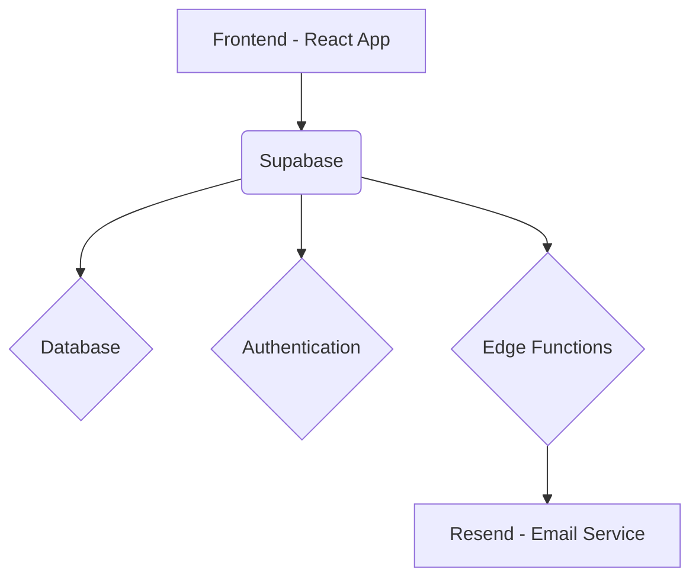

# Body Biz Orderflow Codebase Documentation

This document provides a comprehensive guide to the Off-Price Pro project's codebase, structure, and architecture, aimed at future developers to enable efficient navigation, maintenance, and extension of the application.

## 1. Project Overview

This project is a simple e-commerce website with purchase order functionality.

**Key Features:**
*   Product browsing
*   Cart management
*   Order submission

**Technologies Used:**
*   React
*   Vite
*   Tailwind CSS
*   Shadcn UI
*   Supabase (database and edge functions)
*   Resend (email service)

## 2. Project Structure

The project follows a standard structure for React applications built with Vite and integrated with Supabase.

**Main Directories:**
*   `/src`: Contains the main application source code.
*   `/public`: Contains static assets served directly.
*   `/docs`: Contains project documentation.
*   `/supabase`: Contains Supabase-related files, including migrations and edge functions.
*   `/scripts`: Contains utility scripts, such as seeding the database.

**Key Files:**
*   [`package.json`](package.json): Manages project dependencies and scripts.
*   `.env`: Contains environment variables (e.g., Supabase URL and keys, Resend API key). This file is not committed to version control and needs to be created based on a template or instructions.
*   [`vite.config.ts`](vite.config.ts): Configuration for the Vite build tool.
*   [`tailwind.config.ts`](tailwind.config.ts): Configuration for Tailwind CSS.

**Source Code Organization (`/src`):**
The `/src` directory is organized into the following subdirectories:
*   `/components`: Reusable React components.
    *   `/components/ui`: Contains UI components from Shadcn UI.
*   `/pages`: Top-level components representing different pages of the application.
*   `/utils`: Utility functions and helpers.
*   `/context`: React Context providers for state management.
*   `/hooks`: Custom React hooks.
*   `/integrations`: Code related to external service integrations (e.g., Supabase).
*   `/lib`: General utility library code (e.g., `utils.ts`).

## 3. Website Architecture

The application follows a client-server architecture, with the frontend interacting with a Supabase backend.

**High-Level Architecture Diagram:**



**Frontend:**
*   Built with React, utilizing functional components and JSX.
*   State management primarily uses React hooks (e.g., `useState`, `useEffect`, `useContext`). The `CartContext` in `/src/context` is used for managing the shopping cart state.
*   Data fetching and caching are handled using `@tanstack/react-query`.
*   Routing is managed using `react-router-dom`, configured in [`src/App.tsx`](src/App.tsx).

**Backend:**
*   Supabase is used as the backend-as-a-service.
*   Provides the PostgreSQL database for storing application data (e.g., products, orders).
*   Handles user authentication via its built-in auth system.
*   Hosts server-side logic as Edge Functions (Deno).

**Email Service:**
*   Resend is integrated for sending emails, likely triggered by Supabase Edge Functions (e.g., for order confirmations).

**Data Flow:**
*   The frontend interacts with Supabase through the `@supabase/supabase-js` client library.
*   Data is fetched from and written to the Supabase database via API calls.
*   Sensitive operations or business logic may be handled by Supabase Edge Functions.

**Authentication:**
*   User authentication is managed by Supabase Auth.
*   The frontend uses Supabase client methods and potentially custom hooks to handle user signup, login, logout, and session management.

**Design Patterns:**
*   **Modularity:** The codebase is organized into distinct directories for components, pages, hooks, contexts, etc., promoting modularity.
*   **Reusable Components:** UI elements are built as reusable React components, particularly those in the `/src/components/ui` directory (Shadcn UI).
*   **Hooks:** Custom hooks in `/src/hooks` encapsulate reusable logic.

## 4. Setup and Running Instructions

Follow these steps to set up and run the project locally:

**Prerequisites:**
*   Node.js (LTS version recommended)
*   npm or Bun package manager
*   Git

**Steps:**
1.  **Clone the repository:**
    ```bash
    git clone <repository_url>
    cd body-products
    ```
    (Replace `<repository_url>` with the actual repository URL)
2.  **Install dependencies:**
    ```bash
    # Using npm
    npm install
    # Or using Bun
    bun install
    ```
3.  **Configure environment variables:**
    *   Create a `.env` file in the project root directory.
    *   Obtain your Supabase project URL, `anon` key, and `service_role` key from your Supabase project settings.
    *   Obtain your Resend API key.
    *   Add the following variables to your `.env` file:
        ```env
        VITE_SUPABASE_URL=YOUR_SUPABASE_URL
        VITE_SUPABASE_ANON_KEY=YOUR_SUPABASE_ANON_KEY
        SUPABASE_SERVICE_ROLE_KEY=YOUR_SUPABASE_SERVICE_ROLE_KEY
        RESEND_API_KEY=YOUR_RESEND_API_KEY
        ```
    *   *Note:* The `SUPABASE_SERVICE_ROLE_KEY` and `RESEND_API_KEY` are typically used in Supabase Edge Functions and should be configured as Supabase Secrets, not directly in the frontend's `.env` file. The `VITE_` prefix is for variables exposed to the Vite frontend. Clarify the exact usage based on the Edge Function implementation.
4.  **Start the development server:**
    ```bash
    # Using npm
    npm run dev
    # Or using Bun
    bun dev
    ```
    The application should now be running locally, typically at `http://localhost:5173`.

## 5. Important Commands and Scripts

This section lists common npm/Bun scripts used in the project:

*   `dev`: Starts the development server using Vite.
    ```bash
    npm run dev
    # or
    bun dev
    ```
*   `build`: Builds the project for production.
    ```bash
    npm run build
    # or
    bun build
    ```
*   `build:dev`: Builds the project in development mode.
    ```bash
    npm run build:dev
    # or
    bun run build:dev
    ```
*   `lint`: Runs the linter to check for code style issues.
    ```bash
    npm run lint
    # or
    bun run lint
    ```
*   `preview`: Serves the production build locally for previewing.
    ```bash
    npm run preview
    # or
    bun run preview
    ```

## 6. Additional Notes

This section provides extra guidance for developers working with the codebase.

**Contribution Best Practices:**
*   Follow standard React and TypeScript coding conventions.
*   Write clear and concise commit messages.
*   Ensure your code is formatted consistently (e.g., using Prettier).
*   Write tests for new features or bug fixes where appropriate.
*   Keep documentation updated with code changes.

**Troubleshooting:**
*   **Environment Variable Errors:** Ensure your `.env` file is correctly set up with the necessary Supabase and Resend keys. Verify that `VITE_` prefix is used for variables accessed in the frontend.
*   **Dependency Issues:** If you encounter issues after installing dependencies, try clearing the package manager cache (`npm cache clean --force` or `bun cache clean`) and reinstalling.
*   **Supabase Connection Problems:** Check your Supabase project settings, network connectivity, and ensure the correct URL and keys are used in your `.env` file and Supabase client initialization.
*   **CORS Errors:** If making requests to external services (like Resend directly from the frontend, though ideally handled by Edge Functions), ensure CORS is configured correctly on the server side.

**Future Improvements:**
*   Add comprehensive unit and integration tests.
*   Optimize performance (e.g., code splitting, lazy loading).
*   Implement server-side rendering (SSR) or static site generation (SSG) if needed for SEO or performance.
*   Enhance error handling and logging.
*   Explore more advanced state management solutions if the application grows in complexity.

**Code Examples and External Resources:**
*   **Code Examples:** Relevant code snippets demonstrating key concepts (e.g., Supabase queries, custom hooks, context usage) should be added within the appropriate sections of this document.
*   **External Resources:** Link to the official documentation for the main technologies used:
    *   [React Documentation](https://reactjs.org/docs/getting-started.html)
    *   [Vite Documentation](https://vitejs.dev/guide/)
    *   [Tailwind CSS Documentation](https://tailwindcss.com/docs/)
    *   [Shadcn UI Documentation](https://ui.shadcn.com/docs)
    *   [Supabase Documentation](https://supabase.com/docs)
    *   [Resend Documentation](https://resend.com/docs)